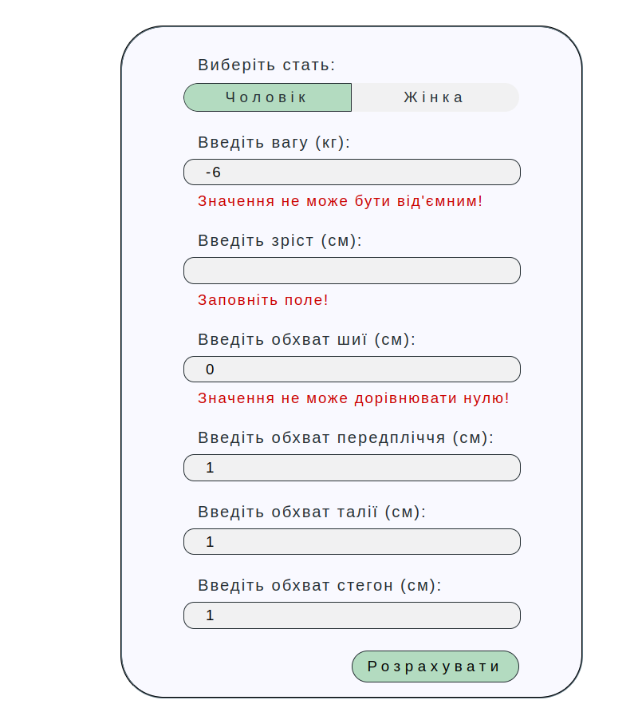

# Цей проєкт було розроблено для закріплення практичних навичок JavaScript
___

## В ході розробці були виконанні наступні кроки:

- Створена форма для введення данних
- Реалізована базова анімація форми
- Розроблен код, що перевіряє введені данні на валідність
- Весь функціонал написано на об'єктах JS

## Програма розраховує та виводить в результат наступні критерії

- Індекс маси тіла
- Відподіну категорію, до якої належить ІМТ
- Проміжок ваги відносно зросту та статі
- Значення ідеальної ваги розрахованної за формулами:
	- Лоренца
	- Брока
- Відсоток підшкірного жиру
- Вагу підшкірного жиру
- Катерогію щодо фігури
- Діапозон відсотку підшкірного жиру
- Ідеальний відсоток підшкірного жиру щодо статі людини
- Висновок відносно того, чи має людина потребу в дієті
- Тип статури (соматотип)
- Показник співвідношення обхвату талії до зросту
- Ризик абдомінального ожиріння ожиріння в області живота
- Показник співвідношення обхвату талії до обхвату стегон
- Ризик розвитку різних захворювань, включаючи цукровий діабет та серцево-судинні захворювання.

## Декілька скріншотів результату

#### Desctop:

